#  Moodle atnaujinimas 3.9.14 -> 4.0.2

## Šaltiniai

* https://docs.moodle.org/400/en/Upgrading

## Planas

Būtina atlikti visus veiksmus ir laikytis veiksmų eiliškumo.

1. Pervesti atnaujinamą sistemą į 'maintainance mode', kad niekas iš naudotojų nieko nedarytų sistemoje atnaujinimų metu.
1. Pasidaryti esamos sistemos kopiją, kad jei kas nepavyktų, galima būtų atstatyti.
    1. Padaryti moodle failų kopiją
    1. Padaryti moodle duomenų bazės kopiją
    1. (optional) Padaryti moodledata (per moodle sukeltų failų) kopiją
1. Atsisiųsti naują moodle versiją į serverį, kur įdiegtas moodle  
1. Senos versijos katalogą pervadinti, kad jo vietoje būtų galima įrašyti naują.
1. Išsarchyvuoti atsisiųstą tar.gz (tgz) failą
1. Pervadinti išarchyvuota moodle katalogą, kad atitiktų senos versijos katalogo pavadinimą.
1. Perkopijuoti temos katalogą ir config.php failą 
1. Atlikti atnaujinimo veiksmus moodle puslapyje.
1. Atnaujinti priedus (plugins)
1. išjungti priežiūros režimą ('maintainance mode'), kad naudotojai galėtų prisijungti ir naudotis sistema.

# Žodynas
Čia ir toliau naudosime tokius terminus ir pavyzdines direktorijas:
* pagrindinis katalogas - tarkime  `/home/jurgitosmoodle/`
* moodle katalogas - tarkime `/home/jurgitosmoodle/public_html`
* moodledata katalogas - tarkime `/home/jurgitosmoodle/moodledata`
* moodle sistemos adresas - tarkime `https://manomoodle.lt`

Galite nusikopijuoti šias instrukcijas ir pakeisti katalogus ir adresus savais.

## Prisijungti prie moodle sistemos `https://manomoodle.lt`

### Puslapio meniu pasirinkti **Administravimas / Papildiniai / Autentifikavimas / Valdyti autentifikavimą**

Jei laukelis `Papildomas prisijungimo URL` (`Alternative login URL`) yra ne tuščias, kas nors įrašyta, išsisaugoti tą nuoroda, ir IŠTRINTI (po atnaujinimo reikės grąžinti).

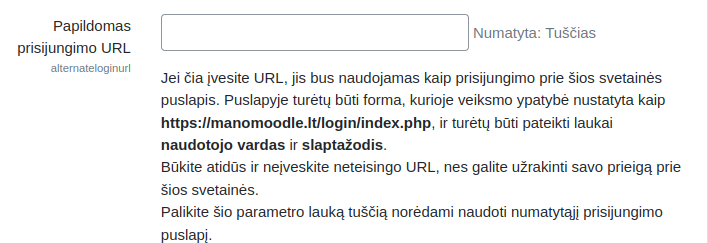

##  Pervesti atnaujinamą sistemą į priežūros režimą ('maintainance mode')

Eiti į **Pagrindinis / Administravimas / Serveris /Priežiūros režimas** ir įjungti priežiūros režimą - spausti `Įrašyti pakeitimus`


Dabar jokie kiti naudotojai, išskyrus jus, negali naudotis sistema. 

##  Moodle atsarginės kopijos kūrimas

Prisijungti prie serverio su ssh ir daryti veiksmus serveryje.

```
ssh jurgitosmoodle@manomoodle.lt
```

Prisijungus svarbu būti pagrindiniame kataloge pvz. `/home/jurgitosmoodle/`

```
cd /home/jugitosmoodle
```

Jame reiks leisti komandas, ir jame bus sukurti visi failai.

### Moodle programos kopija

Moodle programos kopija bus sukurta kataloge kuriame šiuo metu esama - `/home/jugitosmoodle`.
```
tar -czf moodle_39_$(date +"%Y-%m-%d_%H_%M").tar.gz MOODLE_KATALOGAS
```
pvz
```
tar -zcf moodle_39_$(date +"%Y-%m-%d_%H_%M").tar.gz ./public_html
```

Jums sukurs failą `moodle_39_2022-08-05_13.47.tar.gz`, kurį turėtumėte atsisiųsti (tarkime, su filezila) į savo kompiuterį.


### Duomenų bazės kopija

Duomenų bazės kopija bus sukurta kataloge kuriame šiuo metu esama - `/home/jugitosmoodle`.

Pasižiūrėkite kokie yra duomenų bazės prisijungimai:

```
cat public_html/config.php | grep "dbname"
```
Matysite kažką panašaus į :
```
$CFG->dbname    = 'moodle_isi';
```
Kabutėse yra duomenų bazės pavadinimas.

```
cat public_html/config.php | grep "dbuser"
```
Matysite kažką panašaus į :
```
$CFG->dbname    = 'moodle_isi_user';
```
Kabutėse yra duomenų bazės prisijungimo vardas.

```
cat public_html/config.php | grep "dbpass"
```
Matysite kažką panašaus į :
```
$CFG->dbpass    = 'SUPERSlaptažodisNiekamNesakyk';
```
Kabutėse yra duomenų bazės slaptažodis.


Kuriama kopija su mysqldump komanda:
```
mysqldump -u jūsų_db_user -p jūsų_dbname | gzip > moodle_39_$(date +"%Y-%m-%d_%H_%M").sql.gz
```
Paklausus slaptažodžio parašote slaptažodį. Kai rašote slaptažodį jo nesimato. 

Pvz:
```
mysqldump -u moodle_isi_user -p moodle_isi | gzip > moodle_39_$(date +"%Y-%m-%d_%H_%M").sql.gz
Enter password: 
SUPERSlaptažodisNiekamNesakyk
```
Tai sukurs failą `moodle_39_2022-08-05_13.47.tar.gz`, kurį turėtumėte atsisiųsti (tarkime, su filezila) į savo kompiuterį.

Jei naudojate MySQL v8.x ir gaunate klaidą:

```
mysqldump: Error: 'Access denied; you need (at least one of) the PROCESS privilege(s) for this operation' when trying to dump tablespaces
```

naudokite raktą `--no-tablespaces`:

```
mysqldump --no-tablespaces -u moodle_isi_user -p moodle_isi | gzip > moodle_39_$(date +"%Y-%m-%d_%H_%M").sql.gz
```

# Atsisiųsti naują moodle versiją į serverį, kur įdiegtas moodle


https://download.moodle.org/releases/latest/

Spausti copy site ant *Click here to download manually.*

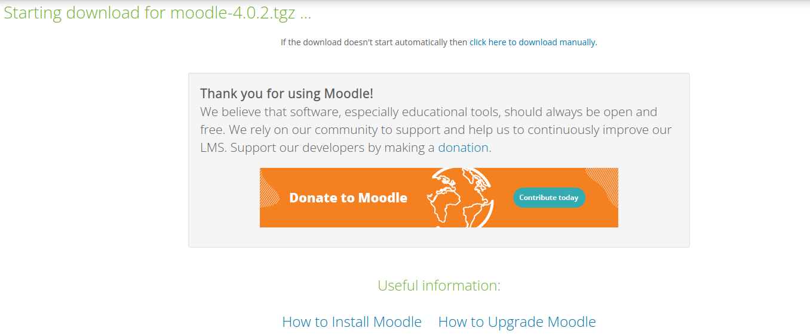

```
cd ~
```

Serveryje pagrindiniame kataloge (`/home/jurgitosmoodle/`): 

```
wget "https://download.moodle.org/download.php/direct/stable400/moodle-4.0.2.tgz"

```

Matysite kažka panašaus į 
```
moodle@moodle4:~$ wget "https://download.moodle.org/download.php/direct/stable400/moodle-4.0.2.tgz"
--2022-08-08 08:08:08--  https://download.moodle.org/download.php/direct/stable400/moodle-4.0.2.tgz
Resolving download.moodle.org (download.moodle.org)... 188.114.99.160, 188.114.98.160, 2a06:98c1:3122:a000::, ...
Connecting to download.moodle.org (download.moodle.org)|188.114.99.160|:443... connected.
HTTP request sent, awaiting response... 200 OK
Length: 61878566 (59M) [application/g-zip]
Saving to: ‘moodle-4.0.2.tgz’

moodle-4.0.2.tgz                         100%[==================================================================================>]  59.01M  72.1MB/s    in 0.8s    

2022-08-08 08:08:08 (72.1 MB/s) - ‘moodle-4.0.2.tgz’ saved [61878566/61878566]

```
jums atsiųs failą `moodle-4.0.2.tgz`

# Senos versijos katalogą pervadinti, kad jo vietoje būtų galima įrašyti naują.

```
mv public_html public_html_old
```

# Išarchyvuoti atsisiųstą tar.gz (tgz) failą

```
tar -xzf moodle-4.0.2.tgz
```

Tai ištrauks archyvą į katalogą `moodle`.

#  Pervadinti išarchyvuota moodle katalogą, kad atitiktų senos versijos katalogo pavadinimą.

```
mv moodle public_html
```

tai pervadins moodle katalogą į public_html.

# Sutvarkyti leidimus failams

Sutvarkyti leidimus failams, kad moodle useris ir sistema galėtų skaityti ir rašyti į visus failus.

```
chmod -R ug+rwX ./public_html/
```

# Perkopijuoti temos katalogą ir config.php failą

```
cp -a public_html_old/config.php public_html
```

(optional)

```
 cp -a -R public_html_old/themes/* public_html/themes
```

# Saugumo sutvarkymas

## sutvarkyti teises į config failą, kad praeitų saugumo patikrinimus

```
chmod ug-w ./public_html/config.php
```

## pašalinti nereikalingus failus

Žemiau išvardinti failai yra Moodle sistemos veikimui yra nereikalingi (naudojami tik Moodle programavimui, arba yra informaciniai) ir juos (pagal saugumo rekomendacijas) galima pašalinti:

```
cd public_html

[ -e .shifter.json ] && rm .shifter.json
[ -e .stylelintrc ] && rm .stylelintrc
[ -e security.txt ] && rm security.txt
[ -e .eslintrc  ] && rm .eslintrc 
[ -e .travis.yml ] && rm .travis.yml
[ -e .gherkin-lintrc ] && rm .gherkin-lintrc
[ -e CONTRIBUTING.txt ] && rm CONTRIBUTING.txt
[ -e .gitattributes ] && rm .gitattributes
[ -e COPYING.txt ] && rm COPYING.txt
[ -e composer.json ] && rm composer.json
[ -e .github ] && rm .github
[ -e Gruntfile.js ] && rm Gruntfile.js
[ -e behat.yml.dist  ] && rm behat.yml.dist 
[ -e composer.lock ] && rm composer.lock
[ -e install ] && rm install
[ -e .grunt ] && rm .grunt
[ -e INSTALL.txt ] && rm INSTALL.txt
[ -e config-dist.php ] && rm config-dist.php
[ -e install.php ] && rm install.php
[ -e .jshintignore  ] && rm .jshintignore 
[ -e PULL_REQUEST_TEMPLATE.txt ] && rm PULL_REQUEST_TEMPLATE.txt
[ -e .jshintrc ] && rm .jshintrc
[ -e README.txt ] && rm README.txt
[ -e package.json ] && rm package.json
[ -e .nvmrc   ] && rm .nvmrc  
[ -e TRADEMARK.txt ] && rm TRADEMARK.txt       
[ -e .phpcs.xml.dist ] && rm .phpcs.xml.dist       
[ -e phpunit.xml.dist ] && rm phpunit.xml.dist

cd ..
```

# Sutvarkyti .htaccess failą

Šis failas naudojamas papildomiems apache2 nustatymams. 

Jei senojoje Moodle versijoje jau yra failas `.htaccess`, reikia persikopijuoti jį iš senos į naują sistemą:
```
[ -e public_html_old/.htaccess ] && cp public_html_old/.htaccess public_html
```

Tada atsidaryti 

```
nano public_html
```

ir patikrinti, ar yra tokie nustatymai: 

Failo pradžioje turi būti: 
```
RewriteEngine On
```

Žemiau turi būti (nebūtinai tokiu eiliškumu):
```
RewriteRule "(\/vendor\/)" - [F]
RewriteRule "(\/node_modules\/)" - [F]
RewriteRule "(^|/)\.(?!well-known\/)" - [F]
RewriteRule "(composer\.json)" - [F]
RewriteRule "(\.lock)" - [F]
RewriteRule "(\/environment.xml)" - [F]
# Options -Indexes
RewriteRule "(\/install.xml)" - [F]
RewriteRule "(\/README)" - [F]
RewriteRule "(\/readme)" - [F]
RewriteRule "(\/moodle_readme)" - [F]
RewriteRule "(\/upgrade\.txt)" - [F]
RewriteRule "(phpunit\.xml\.dist)" - [F]
RewriteRule "(\/tests\/behat\/)" - [F]
RewriteRule "(\/fixtures\/)" - [F]

```


# Atlikti atnaujinimo veiksmus Moodle puslapyje.

Atsidaroma naršyklėje www.manomoodle.lt ir atliekame Moodle atnaujinimą.

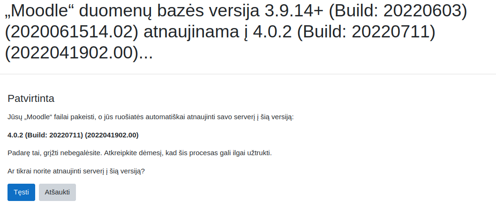

Spausti Tęsti.

Pamatysite

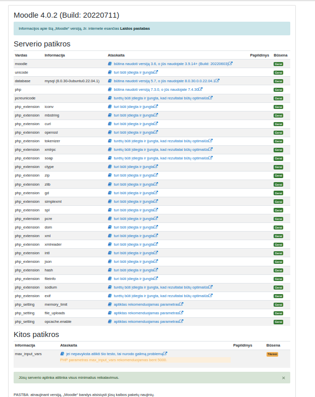

Spausti Tęsti

[testi](images/testi.png)

Gausite

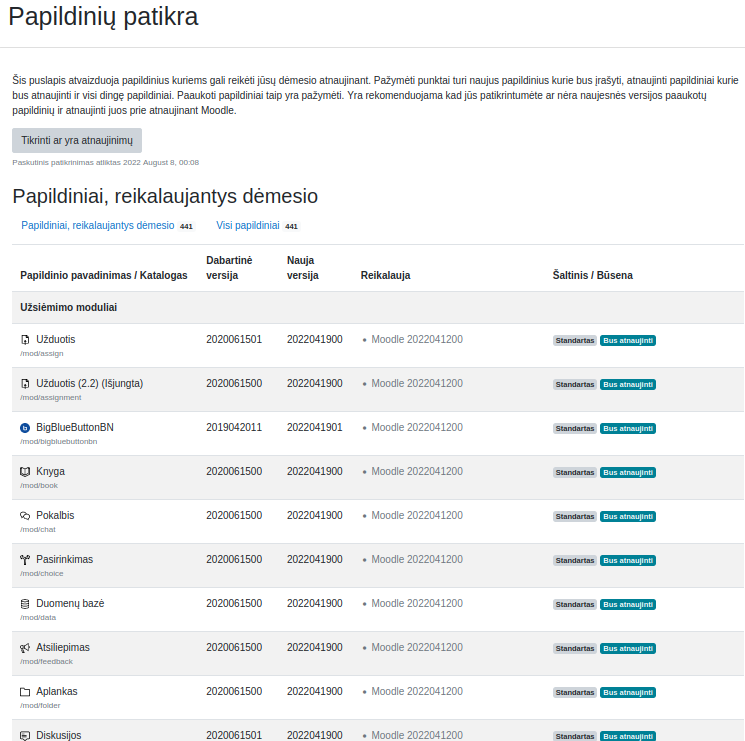

Pasižymėti, kurių trūksta ir spausti Atnaujinti duomenu bazę dabar.

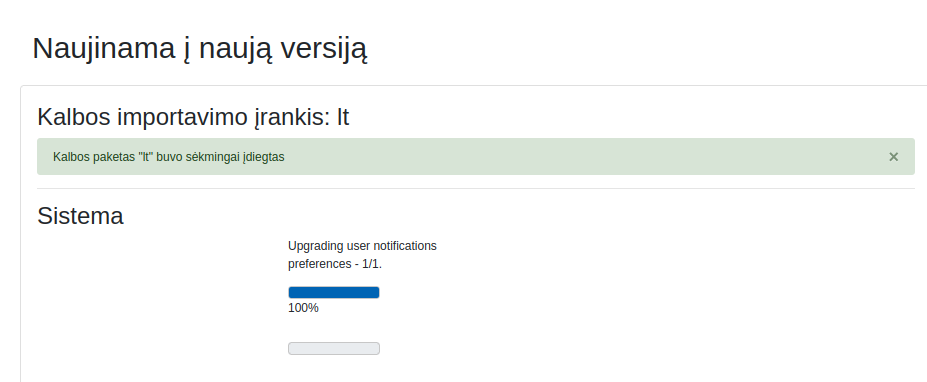

Spausti Tęsti


 Prisijungti:

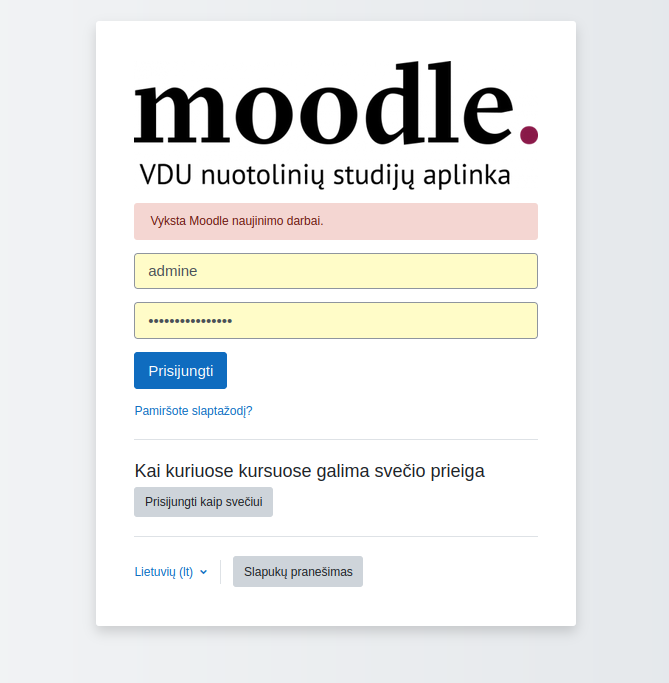

 Atlikite visus būtinus numatytųjų nustatymų pakeitimus ir spustelėkite mygtuką „Išsaugoti pakeitimus“ šio puslapio apačioje.

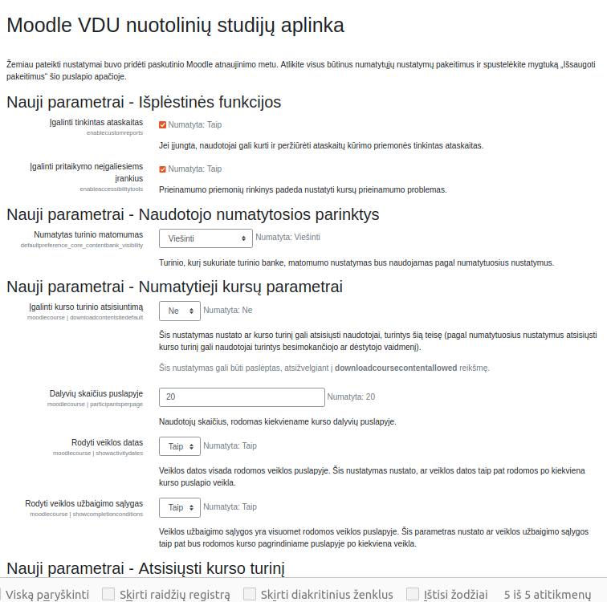

Įrašyti e-mail:

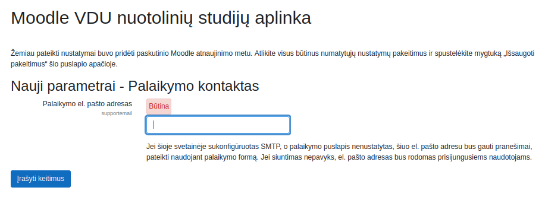

Spausti Tikrinti ar yra atnaujinimų:

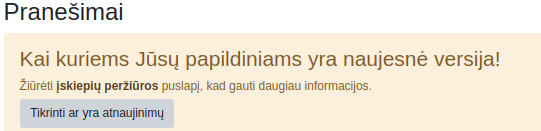

# Atnaujinti papildinius

* Įdiegti papildinius
  * atitinkančius Moodle versiją, automatiškai naudojant įdiegimo langą;

  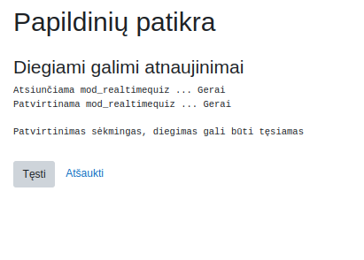

  * neatitinkančius įdiegti atskirai:

   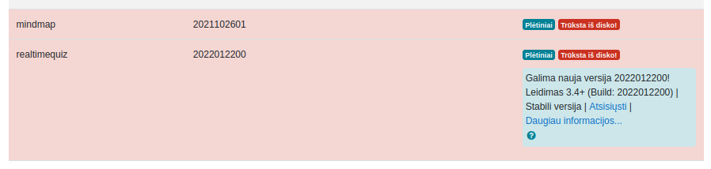

   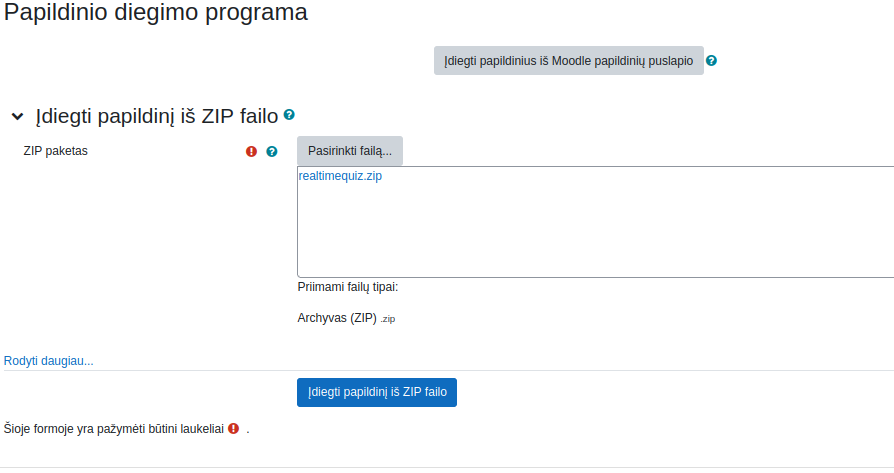

  ### Patikrinti ar nebėra papildinių reikalaujančių dėmesio:

   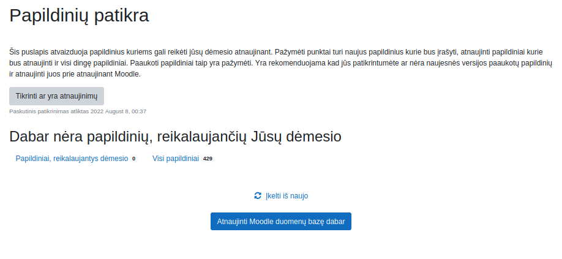

Spausti Atnaujinti Moodle duomenų bazę dabar.

   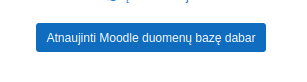

### Peržiūrėti naujus nustatymus ir nustatyti


## Išinstaliuoti iš Moodle neatitinkančius Moodle versijos 
  
## Eiti į **Administravimas / Papildiniai / Papildinių peržiūra**

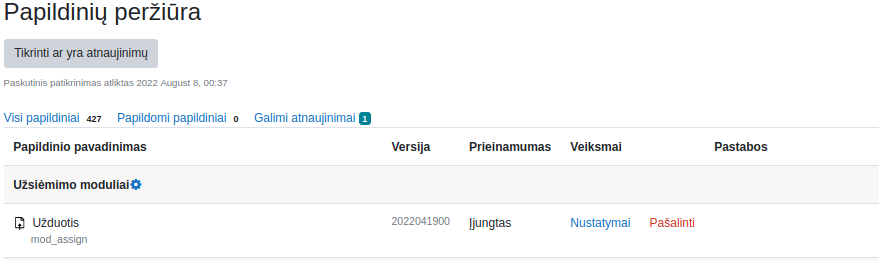

Spausti pašalinti.

## Atnaujinti Pagrindinį ir Mano pradinį puslapius su naujais blokais.

## Puslapio meniu pasirinkti **Administravimas / Papildiniai / Autentifikavimas / Valdyti autentifikavimą** 
 
Jei laukelis `Papildomas prisijungimo URL` (`Alternative login URL`) buvo ne tuščias, kas nors įrašyta, grąžinti  tą nuorodą:


 #  Išjungti priežiūros režimą ('maintainance mode'), kad naudotojai galėtų prisijungti ir naudotis sistema.


 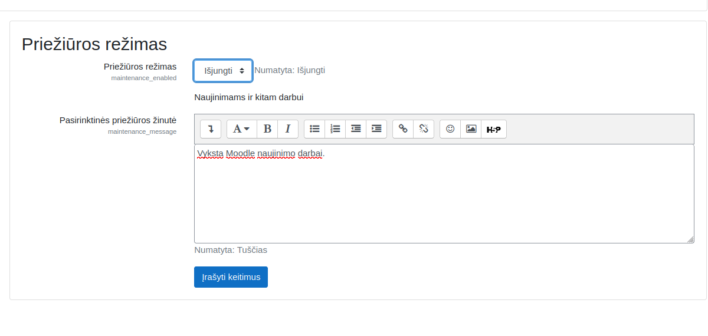

 Spausti Įrašyti keitimus.


